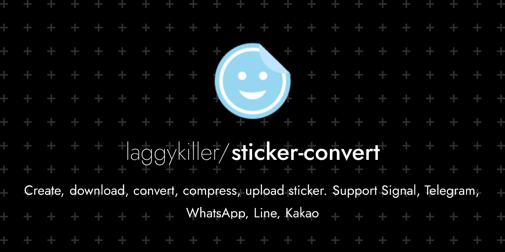
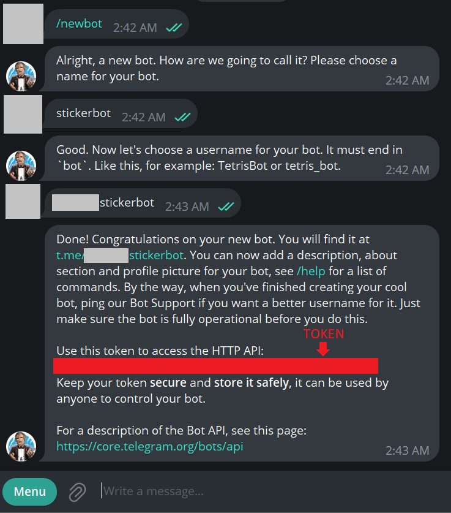
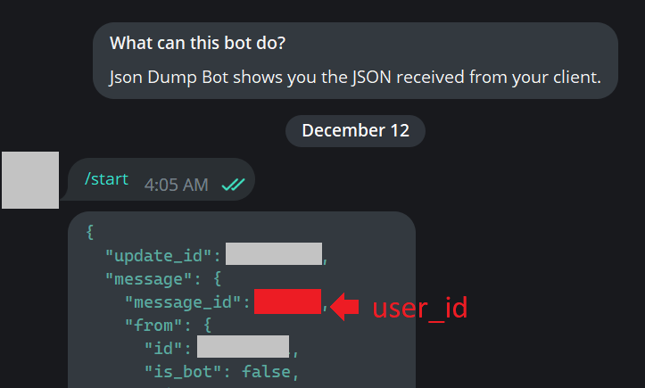

# sticker-convert

- A python script for creating, downloading, converting+compressing and uploading stickers from multiple instant messaging applications.
- With GUI and CLI that runs on Windows, MacOS and Linux
- Currently supports Signal, Telegram, WhatsApp (Create .wastickers), Line (Download only), Kakao (Download only)
- Supports static and animated stickers, with transparency support

## Downloads
- [Pre-compiled releases](https://github.com/laggykiller/sticker-convert/releases) for Windows and MacOS. (Unzip the downloaded file and run `sticker-convert`)
- [Docker image](https://hub.docker.com/r/laggykiller/sticker-convert) for running CLI on Linux.
- [Try in Google Colab without downloading](https://colab.research.google.com/github/laggykiller/sticker-convert/blob/master/sticker_convert_colab.ipynb) (Requires Google account), which runs the code on Google server and get the result from Google Drive. However, it maybe slower than running on your computer.

## Table of contents
- [Compatibility](#compatibility)
- [How to use (GUI)](#how-to-use-gui)
- [How to use (CLI)](#how-to-use-cli)
- [How to use (Docker)](#how-to-use-docker)
- [Running python script directly & Compiling](#running-python-script-directly--compiling)
- [FAQ](#faq)
    - [Getting signal uuid and password](#getting-signal-uuid-and-password)
    - [Getting telegram bot token](#getting-telegram-bot-token)
    - [Importing .wastickers into WhatsApp](#importing-wastickers-into-whatsapp)
    - [Getting stickers from WhatsApp](#getting-stickers-from-whatsapp)
    - [I want to upload stickers that are in stickers_output that have not been uploaded yet](#i-want-to-upload-stickers-that-are-in-stickers_output-that-have-not-been-uploaded-yet)
- [Credits](#credits)
- [DISCLAIMER](#disclaimer)

## Compatibility
- Signal
    - Download: Supported. (e.g. `https://signal.art/addstickers/#pack_id=xxxxx&pack_key=xxxxx`)
    - Upload: Supported
        - `uuid` and `password` are needed if you want to automatically upload the pack with the program. View FAQ for more information.
        - Alternatively, you may use Signal Desktop to manually upload and create sticker pack with the output of this prorgam.
- Telegram (e.g. `https://telegram.me/addstickers/xxxxx`)
    - Download: Supported, but require bot token
    - Upload: Supported, but require bot token and user_id. Alternatively, you may manually upload and create sticker pack with the output of this program.
- Whatsapp
    - Download: You have to manually find sticker packs / extract from your phone or from WhatsApp Web
        - Android Phone: Inside "/storage/emulated/0/Whatsapp/media/Whatsapp Stickers" OR "/storage/emulated/0/Android/media/com.whatsapp/WhatsApp/Media/WhatsApp Stickers"
        - Any: Go to WhatsApp Web, right click on sticker and click "Save image as..."
    - Upload: The program can create .wastickers file, which could then be imported into WhatsApp via a third-party app named 'Sticker Maker' (The author of this repo is NOT affiliated with Sticker Maker). View FAQ for more information
- Line
    - Download: Supported (e.g. https://store.line.me/stickershop/product/1234/en OR line://shop/detail/1234 OR 1234)
        - Search on official site: http://www.line-stickers.com/
        - Search on non-official site (Include region locked and expired packs): http://www.line-stickers.com/
        - For more information: https://github.com/doubleplusc/Line-sticker-downloader
    - Upload: Not supported. You need to manually submit sticker pack for approval before you can use in app.
- Kakao
    - Download: Supported (e.g. https://e.kakao.com/t/xxxxx)
    - Upload: Not supported. You need to manually submit sticker pack for approval before you can use in app.

## How to use (GUI)


1. Run `sticker-convert.exe`, `sticker-convert` or `python3 main.py`
2. Choose input source.
    - If you are downloading, enter URL address if you want to download from (If applicable)
    - If you are using local files, choose input directory. Defaults to a folder named 'stickers_input' in the same directory as the program. Put files you want to convert into that directory
3. Choose compression options. If unsure, just choose a preset from the option menu.
4. If you just want to download files, check 'No compression'
5. Choose ouput options and output directory
6. Enter title and author of the sticker pack.
7. Enter credentials if you want to download/upload from telegram or upload from Signal (View 'Compatability' and 'FAQ' section for more information)
8. Press 'Start'

## How to use (CLI)
To run in CLI mode, pass on any arguments

```
usage: sticker-convert.exe [-h] [--input-dir INPUT_DIR] [--output-dir OUTPUT_DIR] [--download-signal DOWNLOAD_SIGNAL]
                           [--download-telegram DOWNLOAD_TELEGRAM] [--download-line DOWNLOAD_LINE]
                           [--download-kakao DOWNLOAD_KAKAO] [--export-wastickers] [--export-signal]
                           [--export-telegram] [--no-compress] [--preset {signal,telegram,whatsapp,custom}]
                           [--fps-min FPS_MIN] [--fps-max FPS_MAX] [--res-min RES_MIN] [--res-max RES_MAX]
                           [--quality-min QUALITY_MIN] [--quality-max QUALITY_MAX] [--color-min COLOR_MIN]
                           [--color-max COLOR_MAX] [--steps STEPS] [--vid-size-max VID_SIZE_MAX]
                           [--img-size-max IMG_SIZE_MAX] [--vid-format VID_FORMAT] [--img-format IMG_FORMAT]
                           [--default-emoji DEFAULT_EMOJI] [--processes PROCESSES] [--author AUTHOR] [--title TITLE]
                           [--signal-uuid SIGNAL_UUID] [--signal-password SIGNAL_PASSWORD]
                           [--telegram-token TELEGRAM_TOKEN] [--telegram-userid TELEGRAM_USERID] [--save-cred]

CLI for stickers-convert

options:
  -h, --help            show this help message and exit
  --input-dir INPUT_DIR
                        Specify input directory
  --output-dir OUTPUT_DIR
                        Specify output directory
  --download-signal DOWNLOAD_SIGNAL
                        Download signal stickers from a URL as input (e.g.
                        https://signal.art/addstickers/#pack_id=xxxxx&pack_key=xxxxx)
  --download-telegram DOWNLOAD_TELEGRAM
                        Download telegram stickers from a URL as input (e.g. https://telegram.me/addstickers/xxxxx)
  --download-line DOWNLOAD_LINE
                        Download line stickers from a URL / ID as input (e.g.
                        https://store.line.me/stickershop/product/1234/en OR line://shop/detail/1234 OR 1234)
  --download-kakao DOWNLOAD_KAKAO
                        Download kakao stickers from a URL / ID as input (e.g. https://e.kakao.com/t/xxxxx)
  --export-wastickers   Create a .wastickers file for uploading to whatsapp
  --export-signal       Upload to signal
  --export-telegram     Upload to telegram
  --no-compress         Do not compress files. Useful for only downloading stickers
  --preset {signal,telegram,whatsapp,custom}
                        Use preset
  --fps-min FPS_MIN     Set minimum output fps
  --fps-max FPS_MAX     Set maximum output fps
  --res-min RES_MIN     Set minimum output resolution
  --res-max RES_MAX     Set maximum output resolution
  --quality-min QUALITY_MIN
                        Set minimum quality
  --quality-max QUALITY_MAX
                        Set maximum quality
  --color-min COLOR_MIN
                        Set minimum number of colors (For converting to apng)
  --color-max COLOR_MAX
                        Set maximum number of colors (For converting to apng)
  --steps STEPS         Set number of divisions between min and max settings. Higher value is slower but yields file
                        more closer to the specified file size limit
  --vid-size-max VID_SIZE_MAX
                        Set maximum file size limit for animated stickers
  --img-size-max IMG_SIZE_MAX
                        Set maximum file size limit for static stickers
  --vid-format VID_FORMAT
                        Set file format if input is a animated
  --img-format IMG_FORMAT
                        Set file format if input is a static image
  --default-emoji DEFAULT_EMOJI
                        Set the default emoji for uploading signal and telegram sticker packs
  --processes PROCESSES
                        Set number of processes. Default to cpus in system
  --author AUTHOR       Set author of created sticker pack
  --title TITLE         Set name of created sticker pack
  --signal-uuid SIGNAL_UUID
                        Set signal uuid. Required for uploading signal stickers
  --signal-password SIGNAL_PASSWORD
                        Set signal password. Required for uploading signal stickers
  --telegram-token TELEGRAM_TOKEN
                        Set telegram token. Required for uploading and downloading telegram stickers
  --telegram-userid TELEGRAM_USERID
                        Set telegram user_id (From real account, not bot account). Required for uploading telegram
                        stickers
  --save-cred           Save signal and telegram credentials
  ```

Note: If you are running python script directly, run with main.py

Examples:

Only download from a source

`sticker-convert --download-signal <url> --no-compress`

Convert local files to signal compatible stickers

`sticker-convert --input-dir ./custom-input --output-dir ./custom-output --preset signal`

`sticker-convert --preset signal`

Convert signal to telegram stickers and upload to telegram

`sticker-convert --download-signal <url> --export-telegram --telegram-token <your_bot_token_here> --telegram-userid <your_userid_here> --save-cred`

Convert local files to multiple formats and export

`sticker-convert --export-telegram --export-signal`

Convert local files to a custom format

`sticker-convert --fps-min 3 --fps-max 30 --quality-min 30 --quality-max 90 --res-min 512 --res-max 512 --steps 10 --vid-size-max 500000 --img-size-max 500000 --vid-format .apng --img-format .png`

## How to use (Docker)

Running
```
docker pull laggykiller/sticker-convert:latest
docker run -d -it --name sticker-convert \
    -v /path/to/your/stickers_input:/app/stickers_input \
    -v /path/to/your/stickers_output:/app/stickers_output \
    sticker-convert:latest \
    python3 /app/main.py --help
```

Building
```
docker build . -t sticker-convert
```

## Running python script directly & Compiling
See [COMPILING.md](COMPILING.md)

## FAQ

### Getting signal uuid and password
`uuid` and `password` are needed for uploading Signal stickers.
(Note: If you don't want to do this, you can still upload stickers manually by Signal Desktop)


1. Install Signal Desktop from https://signal.org/en/download/
2. Link Signal Desktop with your phone
3. Open Signal Desktop in the commandline with `Signal.exe --enable-dev-tools` (Windows) or `signal-desktop --enable-dev-tools` (MacOS / Windows)
4. Go to `View -> Toggle Developers tools`
5. Open console
    - `uuid` is the output of running: `window.reduxStore.getState().items.uuid_id`
    - `password` is the output of running: `window.reduxStore.getState().items.password`

Reference: https://github.com/teynav/signalApngSticker

### Getting telegram bot token
`token` needed for uploading and downloading Telegram stickers
(Note: If you don't want to do this, you can still upload stickers manually by using this: https://t.me/stickers)



1. Contact botfather on telegram: https://t.me/botfather
2. Follow instructions here to create a bot and get token: https://core.telegram.org/bots/features#creating-a-new-bot
3. The token looks like this: `110201543:AAHdqTcvCH1vGWJxfSeofSAs0K5PALDsaw`
4. You need to send `/start` to your newly created bot

### Getting telegram user_id
`user_id` needed for uploading Telegram stickers. Note that the user_id should be from a real account, not from the bot account.
(Note: If you don't want to do this, you can still upload stickers manually by using this: https://t.me/stickers)

Follow instruction from this post: https://stackoverflow.com/a/52667196



### Importing .wastickers into WhatsApp
1. Download Sticker maker on your phone [[iOS version](https://apps.apple.com/us/app/sticker-maker-studio/id1443326857) | [Android version](https://play.google.com/store/apps/details?id=com.marsvard.stickermakerforwhatsapp)]
2. Transfer the .wastickers file into your phone
3. Share the file to Sticker Maker app
4. Inside Sticker Maker app, you can then import the stickers into WhatsApp

### Getting stickers from WhatsApp
- Android Phone: Inside "/storage/emulated/0/Whatsapp/media/Whatsapp Stickers" OR "/storage/emulated/0/Android/media/com.whatsapp/WhatsApp/Media/WhatsApp Stickers"
- Any: Go to WhatsApp Web, right click on sticker and click "Save image as..."

### I want to upload stickers that are in stickers_output that have not been uploaded yet
CLI: Run with `--no-compress --export-xxxxx`

GUI: Select `From local directory` for Input source, tick `No compression` box and select `Upload to xxxxx` for Output options

## Credits
- Information about Signal and Telegram stickers: https://github.com/teynav/signalApngSticker
- Information about Line and Kakao stickers: https://github.com/star-39/moe-sticker-bot
- Information about Line stickers: https://github.com/doubleplusc/Line-sticker-downloader
- Application icon taken from [Icons8](https://icons8.com/)

## DISCLAIMER
- The author of this repo is NOT affiliated with Signal, Telegram, WhatsApp, Line, Kakao or Sticker Maker.
- The author of this repo is NOT repsonsible for any legal consequences and loss incurred from using this repo.
