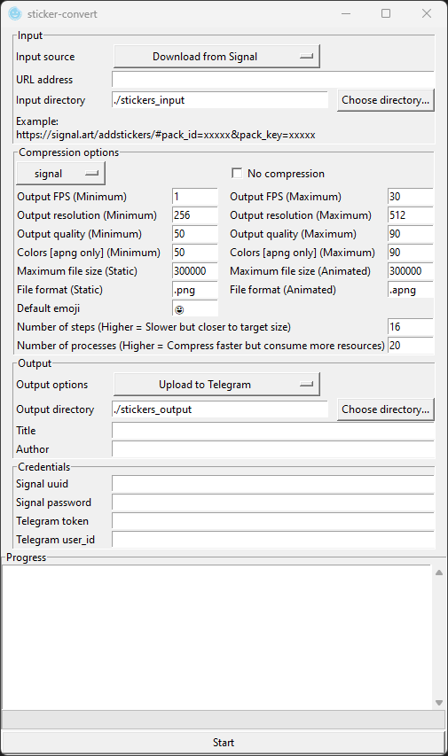

# sticker-convert
A python script for creating, downloading, converting+compressing and uploading stickers from multiple instant messaging applications.

With GUI and CLI that runs on Windows, MacOS and Linux

Currently supports Signal, Telegram, WhatsApp (Create .wastickers), Line (Download only), Kakao (Download only)

Supports static and animated stickers, with transparency support

## Compatibility
- Signal
    - Download: Supported. (e.g. `https://signal.art/addstickers/#pack_id=xxxxx&pack_key=xxxxx`)
    - Upload: Supported
        - `uuid` and `password` are needed if you want to automatically upload the pack with the program. View FAQ for more information.
        - Alternatively, you may use Signal Desktop to manually upload and create sticker pack with the output of this prorgam.
- Telegram (e.g. `https://telegram.me/addstickers/xxxxx`)
    - Download: Supported, but require bot token
    - Upload: Supported, but require bot token and user_id. Alternatively, you may manually upload and create sticker pack with the output of this program.
- Whatsapp
    - Download: You have to manually find sticker packs / extract from your phone
    - Upload: The program can create .wastickers file, which could then be imported into WhatsApp via a third-party app named 'Sticker Maker' (The author of this repo is NOT affiliated with Sticker Maker). View FAQ for more information
- Line
    - Download: Supported (e.g. https://store.line.me/stickershop/product/1234/en OR line://shop/detail/1234 OR 1234)
        - Search on official site: http://www.line-stickers.com/
        - Search on non-official site (Include region locked and expired packs): http://www.line-stickers.com/
        - For more information: https://github.com/doubleplusc/Line-sticker-downloader
    - Upload: Not supported. You need to manually submit sticker pack for approval before you can use in app.
- Kakao
    - Download: Supported (e.g. https://e.kakao.com/t/xxxxx)
    - Upload: Not supported. You need to manually submit sticker pack for approval before you can use in app.

## Pre-compiled releases
Pre-compiled releases available for Windows and MacOS, for both GUI and CLI version. Unzip the downloaded file and run sticker_convert_cli or sticker_convert_gui

Docker image of the CLI version is available for Linux.

If you do not trust those, you may follow 'Running python script directly' section to run the python script directly. However, you will need to install multiple dependencies.

## How to use (GUI)


1. Run sticker_convert_gui.exe
2. Choose input source.
    - If you are downloading, enter URL address if you want to download from (If applicable)
    - If you are using local files, choose input directory. Defaults to a folder named 'stickers_input' in the same directory as the program. Put files you want to convert into that directory
3. Choose compression options. If unsure, just choose a preset from the option menu.
4. If you just want to download files, check 'No compression'
5. Choose ouput options and output directory
6. Enter title and author of the sticker pack.
7. Enter credentials if you want to download/upload from telegram or upload from Signal (View 'Compatability' and 'FAQ' section for more information)
8. Press 'Start'

## How to use (CLI)
```
usage: sticker_convert_cli.exe [-h] [--input-dir INPUT_DIR] [--output-dir OUTPUT_DIR]
                               [--download-signal DOWNLOAD_SIGNAL] [--download-telegram DOWNLOAD_TELEGRAM]
                               [--download-line DOWNLOAD_LINE] [--download-kakao DOWNLOAD_KAKAO] [--export-wastickers]
                               [--export-signal] [--export-telegram] [--no-compress]
                               [--preset {signal,telegram,whatsapp,custom}] [--fps-min FPS_MIN] [--fps-max FPS_MAX]
                               [--res-min RES_MIN] [--res-max RES_MAX] [--quality-min QUALITY_MIN]
                               [--quality-max QUALITY_MAX] [--color-min COLOR_MIN] [--color-max COLOR_MAX]
                               [--steps STEPS] [--vid-size-max VID_SIZE_MAX] [--img-size-max IMG_SIZE_MAX]
                               [--vid-format VID_FORMAT] [--img-format IMG_FORMAT] [--default-emoji DEFAULT_EMOJI]
                               [--processes PROCESSES] [--author AUTHOR] [--title TITLE] [--signal-uuid SIGNAL_UUID]
                               [--signal-password SIGNAL_PASSWORD] [--telegram-token TELEGRAM_TOKEN]
                               [--telegram-userid TELEGRAM_USERID] [--save-cred]

CLI for stickers-convert

options:
  -h, --help            show this help message and exit
  --input-dir INPUT_DIR
                        Specify input directory
  --output-dir OUTPUT_DIR
                        Specify output directory
  --download-signal DOWNLOAD_SIGNAL
                        Download signal stickers from a URL as input (e.g.
                        https://signal.art/addstickers/#pack_id=xxxxx&pack_key=xxxxx)
  --download-telegram DOWNLOAD_TELEGRAM
                        Download telegram stickers from a URL as input (e.g. https://telegram.me/addstickers/xxxxx)
  --download-line DOWNLOAD_LINE
                        Download line stickers from a URL / ID as input (e.g.
                        https://store.line.me/stickershop/product/1234/en OR line://shop/detail/1234 OR 1234)
  --download-kakao DOWNLOAD_KAKAO
                        Download kakao stickers from a URL / ID as input (e.g. https://e.kakao.com/t/xxxxx)
  --export-wastickers   Create a .wastickers file for uploading to whatsapp
  --export-signal       Upload to signal
  --export-telegram     Upload to telegram
  --no-compress         Do not compress files. Useful for only downloading stickers
  --preset {signal,telegram,whatsapp,custom}
                        Use preset
  --fps-min FPS_MIN     Set minimum output fps
  --fps-max FPS_MAX     Set maximum output fps
  --res-min RES_MIN     Set minimum output resolution
  --res-max RES_MAX     Set maximum output resolution
  --quality-min QUALITY_MIN
                        Set minimum quality
  --quality-max QUALITY_MAX
                        Set maximum quality
  --color-min COLOR_MIN
                        Set minimum number of colors (For converting to apng)
  --color-max COLOR_MAX
                        Set maximum number of colors (For converting to apng)
  --steps STEPS         Set number of divisions between min and max settings. Higher value is slower but yields file
                        more closer to the specified file size limit
  --vid-size-max VID_SIZE_MAX
                        Set maximum file size limit for animated stickers
  --img-size-max IMG_SIZE_MAX
                        Set maximum file size limit for static stickers
  --vid-format VID_FORMAT
                        Set file format if input is a animated
  --img-format IMG_FORMAT
                        Set file format if input is a static image
  --default-emoji DEFAULT_EMOJI
                        Set the default emoji for uploading signal and telegram sticker packs
  --processes PROCESSES
                        Set number of processes. Default to cpus in system
  --author AUTHOR       Set author of created sticker pack
  --title TITLE         Set name of created sticker pack
  --signal-uuid SIGNAL_UUID
                        Set signal uuid. Required for uploading signal stickers
  --signal-password SIGNAL_PASSWORD
                        Set signal password. Required for uploading signal stickers
  --telegram-token TELEGRAM_TOKEN
                        Set telegram token. Required for uploading and downloading telegram stickers
  --telegram-userid TELEGRAM_USERID
                        Set telegram user_id (From real account, not bot account). Required for uploading telegram
                        stickers
  --save-cred           Save signal and telegram credentials
```

Note: If you are running python script directly, run with sticker_convert_cli.py

Examples:

Only download from a source

`sticker_convert_cli --download-signal <url> --no-compress`

Convert local files to signal compatible stickers

`sticker_convert_cli --input-dir ./custom-input --output-dir ./custom-output --preset signal`

`sticker_convert_cli --preset signal`

Convert signal to telegram stickers

`sticker_convert_cli --download-signal <url> --export-telegram`

Convert local files to multiple formats and export

`sticker_convert_cli --export-telegram --export-signal`

Convert local files to a custom format

`sticker_convert_cli --fps-min 3 --fps-max 30 --quality-min 30 --quality-max 90 --res-min 512 --res-max 512 --steps 10 --vid-size-max 500000 --img-size-max 500000 --vid-format .apng --img-format .png`

## Running python script directly
*Note: Run scripts with `python ./sticker-convert/sticker_convert_cli.py`

First, install python3

The following python modules are required:
- `requests`
- `ffmpeg-python`
- `wand`
- `lottie`
- `argparse`
- `signalstickers_client`
- `python-telegram-bot`
- `anyio`

For Windows, the following executables are required:
- `ffmpeg.exe` and `ffprobe.exe`
    - Both can be found in https://ffmpeg.org/download.html
    - Direct link (May break): https://www.gyan.dev/ffmpeg/builds/ffmpeg-git-essentials.7z
- `magick.exe`
    - Download page for ImageMagick: https://imagemagick.org/script/download.php#windows
    - Note that you should choose one that ends with '-dll' and NOT portable version
    - Direct link (May break): https://imagemagick.org/archive/binaries/ImageMagick-7.1.0-54-Q16-HDRI-x64-dll.exe
- `zip.exe`
    - Download page: https://gnuwin32.sourceforge.net/packages/zip.htm
    - Direct link: http://downloads.sourceforge.net/gnuwin32/zip-3.0-bin.zip
    - All files in `bin` directory are needed
- `bzip2.exe`
    - Download page: https://gnuwin32.sourceforge.net/packages/bzip2.htm
    - Direct link: https://sourceforge.net/projects/gnuwin32/files/bzip2/1.0.5/bzip2-1.0.5-bin.zip
    - All files in `bin` directory are needed
- `optipng.exe`
    - Download page: https://sourceforge.net/projects/optipng/files/OptiPNG/
    - Direct link: https://sourceforge.net/projects/optipng/files/OptiPNG/optipng-0.7.7/optipng-0.7.7-win32.zip
- `pngnq-s9.exe`
    - Download page: https://sourceforge.net/projects/pngnqs9/files/
    - Direct link: https://sourceforge.net/projects/pngnqs9/files/pngnq-s9-2.0.1-win32.zip/download
- `pngquant.exe`
    - Download page: https://pngquant.org/
    - Direct link: https://pngquant.org/pngquant-windows.zip
- `apngdis.exe`
    - Download page: https://sourceforge.net/projects/apngdis/files/
    - Direct link: https://sourceforge.net/projects/apngdis/files/2.9/apngdis-2.9-bin-win64.zip
- `apngasm.exe`
    - Note that version 3 is required. Sourceforge only provides up to version 2.
    - Download page: https://github.com/apngasm/apngasm/releases
    - Direct link: https://github.com/apngasm/apngasm/releases/download/3.1.1/apngasm_3.1-0_AMD64.exe

Create a directory named `bin` in the root of this repo and place the executables into it

For MacOS, the following binaries are required:
- `ffmpeg` and `ffprobe`
    - Eaisest method is download from Homebrew `brew install ffmpeg`
- `magick`
    - Eaisest method is download from Homebrew `brew install imagemagick`
- `optipng`
    - Easiest method is download from Homebrew `brew install optipng`
- `pngnq-s9`
    - Compilation is required: https://github.com/ImageProcessing-ElectronicPublications/pngnq-s9
    - Compilation instructions are in https://github.com/ImageProcessing-ElectronicPublications/pngnq-s9/blob/master/INSTALL
    - Note that you should add `#include <string.h>` to `src/rwpng.c` or else compilation fails
- `pngquant`
    - Easiest method is download from Homebrew `brew install pngquant`
- `apngdis`
    - Note that version 2.9 is required. Some homebrew-extra provides apngdis but it is version 2.8
    - Download page: https://apngdis.sourceforge.net/
    - Direct link: https://sourceforge.net/projects/apngdis/files/2.9/apngdis-2.9-bin-macos.zip
    - Create a directory named `bin` in the root of this repo and place the executables into it
- `apngasm`
    - Easiest method is download from Homebrew `brew install apngasm`
    - Note that version 3 is required. Sourceforge only provides up to version 2.

For Linux, the following binaries are required:
- `ffmpeg` and `ffprobe`
- `magick`
- `optipng`
- `pngnq-s9`
- `pngquant`
- `apngdis`
- `apngasm`
    - Note that version 3 is required. Sourceforge only provides up to version 2.

## Compiling

### Windows
1. Refer to the instructions in running python script directly for installing python modules and executables
2. Run `pyinstaller sticker_convert_cli_windows.spec` or `pyinstaller sticker_convert_gui_windows.spec`
3. Compilation result in `dist` directory

### MacOS
1. Refer to the instructions in running python script directly for installing python modules and binaries (Except imagemagick, ffmpeg and ffprobe)
2. `ImageMagick` precompiled portable version is broken in newer releases of MacOS. You need to compile ImageMagick. Run `magick-compile-macos.sh` first
    - Ref1: https://stackoverflow.com/questions/55754551/how-to-install-imagemagick-portably-on-macos-when-i-cant-set-dyld-library-path
    - Ref2: https://github.com/ImageMagick/ImageMagick/issues/3129
3. Get static build of `ffmpeg` and `ffprobe` from: https://evermeet.cx/ffmpeg/ (If down, then go to https://ffmpeg.org/download.html). 
4. Create `bin` directory and place `ffmpeg`, `ffprobe` and `apngdis` into `bin` directory located in this repo
5. Run `pyinstaller sticker_convert_cli_macos.spec` or `pyinstaller sticker_convert_gui_windows.spec`
6. Compilation result in `dist` directory

### Linux


## FAQ

### Getting signal uuid and password
`uuid` and `password` are needed for uploading Signal stickers.

1. Open Signal Desktop in the commandline with `signal-desktop --enable-dev-tools`
2. Goto Menu
3. Toggle Developers tools
4. Open console
    - `uuid` is the output of running: `window.reduxStore.getState().items.uuid_id`
    - `password` is the output of running: `window.reduxStore.getState().items.password`

(Note: If you don't want to do this, you can still upload stickers manually by Signal Desktop)

Reference: https://github.com/teynav/signalApngSticker

### Getting telegram bot token
`token` needed for uploading and downloading Telegram stickers

1. Contact botfather on telegram: https://t.me/botfather
2. Follow instructions here to create a bot and get token: https://core.telegram.org/bots/features#creating-a-new-bot
3. The token looks like this: `110201543:AAHdqTcvCH1vGWJxfSeofSAs0K5PALDsaw`
4. You need to send `/start` to your newly created bot

### Getting telegram user_id
`user_id` needed for uploading Telegram stickers. Note that the user_id should be from a real account, not from the bot account.

Follow instruction from this post: https://stackoverflow.com/a/52667196

### Importing .wastickers into WhatsApp
1. Download Sticker maker on your phone [[iOS version](https://apps.apple.com/us/app/sticker-maker-studio/id1443326857) | [Android version](https://play.google.com/store/apps/details?id=com.marsvard.stickermakerforwhatsapp)]
2. Transfer the .wastickers file into your phone
3. Share the file to Sticker Maker app
4. Inside Sticker Maker app, you can then import the stickers into WhatsApp

## Credits
- Information about Signal and Telegram stickers: https://github.com/teynav/signalApngSticker
- Information about Line and Kakao stickers: https://github.com/star-39/moe-sticker-bot
- Information about Line stickers: https://github.com/doubleplusc/Line-sticker-downloader
- Application icon taken from [Icons8](https://icons8.com/)

## DISCLAIMER
- The author of this repo is NOT affiliated with Signal, Telegram, WhatsApp, Line, Kakao or Sticker Maker.
- The author of this repo is NOT repsonsible for any legal consequences and loss incurred from using this repo.