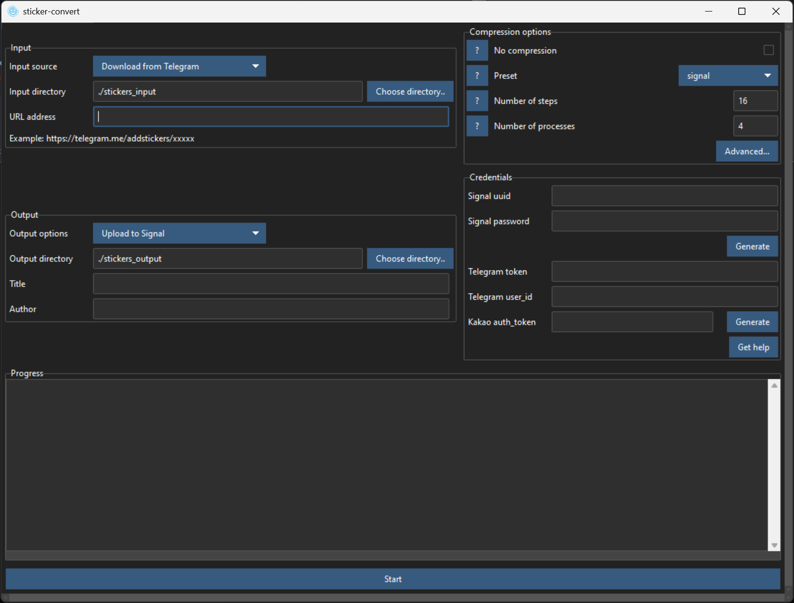
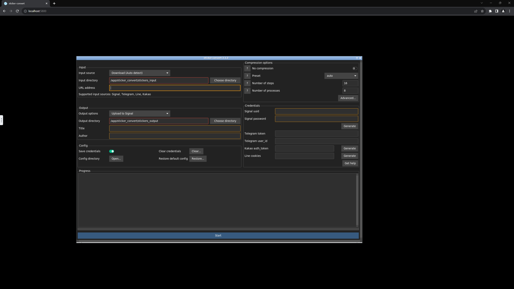

# sticker-convert



- A python script for creating, downloading, converting+compressing and uploading stickers from multiple instant messaging applications.
- With GUI and CLI that runs on Windows, MacOS and Linux
- Currently supports Signal, Telegram, WhatsApp (Create .wastickers), Line (Download only), Kakao (Download only), Naver Band (Download only), OGQ (Download only), Viber, Discord (Download only), iMessage (Create Xcode sticker pack project)
- Supports static and animated stickers, with transparency support

## Downloads
- [Pre-compiled releases](https://github.com/laggykiller/sticker-convert/releases) for Windows, MacOS and Linux (As AppImage).
    - Windows: Unzip the downloaded file and run `sticker-convert.exe`, or download msi file for installation
    - MacOS: Unzip the downloaded file, hold control and open `hold_control_and_click_open_me.command` for the first time, then `sticker-convert.app` in the future
    - Linux:
        - AppImage: `chmod +x` the downloaded AppImage and run it
        - Zip: unzip and run `sticker-convert.bin`
        - [AUR package](https://aur.archlinux.org/packages/sticker-convert): `makepkg -si`
- [pip package](https://pypi.org/project/sticker-convert/): `pip install sticker-convert`. Launch with `sticker-convert` or `python -m sticker_convert`
- [Docker image](https://hub.docker.com/r/laggykiller/sticker-convert) for running on Linux.
- [Try in Google Colab without downloading](https://colab.research.google.com/github/laggykiller/sticker-convert/blob/master/sticker_convert_colab.ipynb) (Requires Google account), which runs the code on Google server and get the result from Google Drive. However, it maybe slower than running on your computer. (~15 seconds per file if not converting to .apng, ~1 minute per file if you convert to .apng)

## Table of contents
- [Compatibility](#compatibility)
- [How to use (GUI)](#how-to-use-gui)
- [How to use (CLI)](#how-to-use-cli)
- [How to use (Docker)](#how-to-use-docker)
- [Running python script directly & Compiling](#running-python-script-directly--compiling)
- [FAQ](#faq)
    - [Platform-specific guides (e.g. Getting credentials)](#platform-specific-guides-eg-getting-credentials)
    - [Conversion is slow](#conversion-is-slow)
    - [Running out of RAM / System frozen](#running-out-of-ram--system-frozen)
    - [MacOS complains that program from unidentified developer](#macos-complains-that-program-from-unidentified-developer)
    - [I want to upload stickers that are in stickers_output that have not been uploaded yet](#i-want-to-upload-stickers-that-are-in-stickers_output-that-have-not-been-uploaded-yet)
    - [Where are credentials stored?](#where-are-credentials-stored)
    - [What does "power" and "steps" mean?](#what-does-power-and-steps-mean)
- [Future plans](#future-plans)
- [Credits](#credits)
- [DISCLAIMER](#disclaimer)

## Compatibility
| Application                           | ⬇️ Download                         | ⬆️ Upload                                                |
| ------------------------------------- | ------------------------------------| --------------------------------------------------------- |
| [Signal](docs/guide_signal.md)        | ✅                                  | ✅ (Require `uuid` & `password` or manually)             |
| [Telegram](docs/guide_telegram.md)    | ✅ (Require `token` or telethon)    | ✅ (Require `token` & `user_id` or telethon or manually) |
| [WhatsApp](docs/guide_whatsapp.md)    | ⭕ (By Android or WhatsApp Web)     | ⭕ (Create `.wastickers`, import by Sticker Maker)       |
| [Line](docs/guide_line.md)            | ✅                                  | 🚫 (Need to submit for manual approval)                  |
| [Kakao](docs/guide_kakao.md)          | ✅ (Need 'auth_token' for animated) | 🚫 (Need to submit for manual approval)                  |
| [Band](docs/guide_band.md)            | ✅                                  | 🚫 (Need to submit for manual approval)                  |
| [OGQ](docs/guide_ogq.md)            | ✅                                  | 🚫 (Need to submit for manual approval)                  |
| [Viber](docs/guide_viber.md)          | ✅                                  | ✅ (Require `viber_auth`)                                |
| [Discord](docs/guide_discord.md)      | ✅ (Require `token`)                | 🚫                                                       |
| [iMessage](docs/guide_imessage.md)    | 🚫                                  | ⭕ (Create Xcode stickerpack project for sideload)       |

✅ = Supported ⭕ = Partially supported 🚫 = Not supported

- Signal
    - Download: Supported. (e.g. `https://signal.art/addstickers/#pack_id=xxxxx&pack_key=xxxxx`)
    - Upload: Supported
        - `uuid` and `password` are needed if you want to automatically upload the pack with the program. View FAQ for more information.
        - Alternatively, you may use Signal Desktop to manually upload and create sticker pack with the output of this prorgam.
- Telegram
    - Download: Supported (e.g. `https://telegram.me/addstickers/xxxxx`) for both stickers and custom emoji, but require bot token or setup Telethon
    - Upload: Supported for both stickers and custom emoji, but require bot token and user_id or setup Telethon. Alternatively, you may manually upload and create sticker pack with the output of this program.
- WhatsApp
    - Download: You have to manually find sticker packs / extract from your phone or from WhatsApp Web. Learn more from [docs/guide_whatsapp.md](docs/guide_whatsapp.md)
    - Upload: The program can create .wastickers file, which could then be imported into WhatsApp via a third-party app named 'Sticker Maker' (The author of this repo is NOT affiliated with Sticker Maker). View FAQ for more information.
- Line
    - Download: Supported (e.g. `https://store.line.me/stickershop/product/1234/en` OR `line://shop/detail/1234` OR `1234`)
        - Search on official site: https://store.line.me/stickershop
        - Search on non-official site (Include region locked and expired packs): http://www.line-stickers.com/
        - For more information: https://github.com/doubleplusc/Line-sticker-downloader
    - Upload: Not supported. You need to manually submit sticker pack for approval before you can use in app.
- Kakao
    - Download: Supported (e.g. `https://e.kakao.com/t/xxxxx`  OR `https://emoticon.kakao.com/items/xxxxx` OR `4404400`). It is rather complicated, learn more from [docs/guide_kakao.md](docs/guide_kakao.md)
    - Upload: Not supported. You need to manually submit sticker pack for approval before you can use in app.
- Band
    - Download: Supported (e.g. `https://www.band.us/sticker/xxxx` OR 2535). Learn how to get share link from [docs/guide_band.md](docs/guide_band.md)
    - Upload: Not supported. You need to manually submit sticker pack for approval before you can use in app.
- OGQ
    - Download: Supported (e.g. `https://ogqmarket.naver.com/artworks/sticker/detail?artworkId=xxxxx`)
    - Upload: Not supported. You need to manually submit sticker pack for approval before you can use in app.
- Viber
    - Download: Supported (e.g. `https://stickers.viber.com/pages/example` OR `https://stickers.viber.com/pages/custom-sticker-packs/example`)
    - Upload: Supported. Viber authentication data required for uploading Viber stickers, which could be fetched from Viber Desktop application automatically.
- Discord
    - Download: Supported (e.g. `https://discord.com/channels/169256939211980800/@home` OR `169256939211980800`), but require user token.
    - Upload: Not supported.
- iMessage
    - Download: Not supported.
    - Upload: The program can create Xcode project for iMessage sticker pack, which could then be compiled and sideloaded using Xcode.

## How to use (GUI)
1. Run `sticker-convert.exe`, `sticker-convert.app` or `python3 src/sticker-convert.py`
2. Choose input source.
    - If you are downloading, enter URL address if you want to download from (If applicable)
    - If you are using local files, choose input directory. Defaults to a folder named 'stickers_input' in the same directory as the program. Put files you want to convert into that directory
3. Choose compression options. If unsure, just choose a preset from the option menu.
4. If you just want to download files, check 'No compression'
5. Choose ouput options and output directory
6. Enter title and author of the sticker pack.
7. Enter credentials if you want to download/upload from telegram or upload from Signal (View 'Compatability' and 'FAQ' section for more information)
8. Press 'Start'

## How to use (CLI)
To run in CLI mode, pass on any arguments

```
usage: sticker-convert.py [-h] [--version] [--no-confirm] [--no-progress] [--custom-presets CUSTOM_PRESETS] [--input-dir INPUT_DIR]
                          [--download-auto DOWNLOAD_AUTO | --download-signal DOWNLOAD_SIGNAL | --download-telegram DOWNLOAD_TELEGRAM | --download-telegram-telethon DOWNLOAD_TELEGRAM_TELETHON | --download-line DOWNLOAD_LINE | --download-kakao DOWNLOAD_KAKAO | --download-band DOWNLOAD_BAND | --download-ogq DOWNLOAD_OGQ | --download-viber DOWNLOAD_VIBER | --download-discord DOWNLOAD_DISCORD | --download-discord-emoji DOWNLOAD_DISCORD_EMOJI]
                          [--output-dir OUTPUT_DIR] [--author AUTHOR] [--title TITLE]
                          [--export-signal | --export-telegram | --export-telegram-emoji | --export-telegram-telethon | --export-telegram-emoji-telethon | --export-viber | --export-whatsapp | --export-imessage]
                          [--no-compress]
                          [--preset {auto,signal,telegram,telegram_emoji,whatsapp,line,kakao,band,ogq,viber,discord,discord_emoji,imessage_small,imessage_medium,imessage_large,custom}]
                          [--steps STEPS] [--processes PROCESSES] [--fps-min FPS_MIN] [--fps-max FPS_MAX] [--fps-power FPS_POWER]
                          [--res-min RES_MIN] [--res-max RES_MAX] [--res-w-min RES_W_MIN] [--res-w-max RES_W_MAX] [--res-h-min RES_H_MIN]
                          [--res-h-max RES_H_MAX] [--res-power RES_POWER] [--quality-min QUALITY_MIN] [--quality-max QUALITY_MAX]
                          [--quality-power QUALITY_POWER] [--color-min COLOR_MIN] [--color-max COLOR_MAX] [--color-power COLOR_POWER]
                          [--duration-min DURATION_MIN] [--duration-max DURATION_MAX] [--padding-percent PADDING_PERCENT]
                          [--bg-color BG_COLOR] [--vid-size-max VID_SIZE_MAX] [--img-size-max IMG_SIZE_MAX] [--vid-format VID_FORMAT]
                          [--img-format IMG_FORMAT] [--fake-vid] [--scale-filter SCALE_FILTER] [--quantize-method QUANTIZE_METHOD]
                          [--cache-dir CACHE_DIR] [--chromium-path CHROMIUM_PATH] [--default-emoji DEFAULT_EMOJI] [--signal-uuid SIGNAL_UUID]
                          [--signal-password SIGNAL_PASSWORD] [--signal-get-auth] [--telegram-token TELEGRAM_TOKEN]
                          [--telegram-userid TELEGRAM_USERID] [--telethon-setup] [--kakao-auth-token KAKAO_AUTH_TOKEN] [--kakao-get-auth]
                          [--kakao-get-auth-desktop] [--kakao-bin-path KAKAO_BIN_PATH] [--kakao-username KAKAO_USERNAME]
                          [--kakao-password KAKAO_PASSWORD] [--kakao-country-code KAKAO_COUNTRY_CODE]
                          [--kakao-phone-number KAKAO_PHONE_NUMBER] [--line-get-auth] [--line-cookies LINE_COOKIES] [--viber-auth VIBER_AUTH]
                          [--viber-get-auth VIBER_GET_AUTH] [--viber-bin-path VIBER_BIN_PATH] [--discord-get-auth]
                          [--discord-token DISCORD_TOKEN] [--save-cred]

CLI for stickers-convert

options:
  -h, --help            show this help message and exit
  --version             show program's version number and exit
  --no-confirm          Do not ask any questions.
  --no-progress         Do not show progress bar in CLI.
  --custom-presets CUSTOM_PRESETS
                        Specify a json file containing custom compression presets.
                        See compression.json for format.
                        Note that if present, 'custom_preset.json' from config directory would be auto loaded.

Input options:
  --input-dir INPUT_DIR
                        Specify input directory.
  --download-auto DOWNLOAD_AUTO
                        Auto detect URL type and download
                        (Supported input sources: Signal, Telegram, Line, Kakao, Viber, Discord)
  --download-signal DOWNLOAD_SIGNAL
                        Download signal stickers from a URL as input
                        (Example: https://signal.art/addstickers/#pack_id=xxxxx&pack_key=xxxxx)
  --download-telegram DOWNLOAD_TELEGRAM
                        Download telegram stickers from a URL as input
                        (Example: https://telegram.me/addstickers/xxxxx
                         OR https://telegram.me/addemoji/xxxxx)
  --download-telegram-telethon DOWNLOAD_TELEGRAM_TELETHON
                        Download telegram stickers from a URL as input with Telethon
                        (Example: https://telegram.me/addstickers/xxxxx
                         OR https://telegram.me/addemoji/xxxxx)
  --download-line DOWNLOAD_LINE
                        Download line stickers from a URL / ID as input
                        (Example: https://store.line.me/stickershop/product/1234/en
                         OR https://line.me/S/sticker/1234/?lang=en OR line://shop/detail/1234 OR 1234)
  --download-kakao DOWNLOAD_KAKAO
                        Download kakao stickers from a URL / ID as input
                        (Example: https://e.kakao.com/t/xxxxx 
                        OR https://emoticon.kakao.com/items/xxxxx OR 4404400)
  --download-band DOWNLOAD_BAND
                        Download Naver Band stickers from a URL / ID as input
                        (Example: https://www.band.us/sticker/xxxx OR 2535)
  --download-ogq DOWNLOAD_OGQ
                        Download OGQ stickers from a URL / ID as input
                        (Example: https://ogqmarket.naver.com/artworks/sticker/detail?artworkId=xxxxx)
  --download-viber DOWNLOAD_VIBER
                        Download viber stickers from a URL as input
                        (Example: https://stickers.viber.com/pages/example
                        OR https://stickers.viber.com/pages/custom-sticker-packs/example)
  --download-discord DOWNLOAD_DISCORD
                        Download discord stickers from a channel URL / ID as input
                        (Example: https://discord.com/channels/169256939211980800/@home
                        OR 169256939211980800)
  --download-discord-emoji DOWNLOAD_DISCORD_EMOJI
                        Download discord emojis from a channel URL / ID as input
                        (Example: https://discord.com/channels/169256939211980800/@home
                        OR 169256939211980800)

Output options:
  --output-dir OUTPUT_DIR
                        Specify output directory.
  --author AUTHOR       Set author of created sticker pack.
  --title TITLE         Set name of created sticker pack.
  --export-signal       Upload to Signal
  --export-telegram     Upload to Telegram
  --export-telegram-emoji
                        Upload to Telegram (Custom emoji)
  --export-telegram-telethon
                        Upload to Telegram with Telethon *Not recommended, but allow link not end with _by_xxxbot*
  --export-telegram-emoji-telethon
                        Upload to Telegram with Telethon (Custom emoji) *Not recommended, but allow link not end with _by_xxxbot*
  --export-viber        Upload to Viber
  --export-whatsapp     Create a .wastickers file for uploading to WhatsApp
  --export-imessage     Create Xcode project for importing to iMessage

Compression options:
  --no-compress         Do not compress files. Useful for only downloading stickers.
  --preset {auto,signal,telegram,telegram_emoji,whatsapp,line,kakao,band,ogq,viber,discord,discord_emoji,imessage_small,imessage_medium,imessage_large,custom}
                        Apply preset for compression.
  --steps STEPS         Set number of divisions between min and max settings.
                        Steps higher = Slower but yields file more closer to the specified file size limit.
  --processes PROCESSES
                        Set number of processes. Default to half of logical processors in system.
                        Processes higher = Compress faster but consume more resources.
  --fps-min FPS_MIN     Set minimum output fps.
  --fps-max FPS_MAX     Set maximum output fps.
  --fps-power FPS_POWER
                        Between -1 and positive infinity. Power lower = More importance of the parameter, try harder to keep higher and not sacrifice.
  --res-min RES_MIN     Set minimum width and height
  --res-max RES_MAX     Set maximum width and height
  --res-w-min RES_W_MIN
                        Set minimum width.
  --res-w-max RES_W_MAX
                        Set maximum width.
  --res-h-min RES_H_MIN
                        Set minimum height.
  --res-h-max RES_H_MAX
                        Set maximum height.
  --res-power RES_POWER
                        Between -1 and positive infinity.
                        Power lower = More importance of the parameter,
                        try harder to keep higher and not sacrifice.
  --quality-min QUALITY_MIN
                        Set minimum quality.
  --quality-max QUALITY_MAX
                        Set maximum quality.
  --quality-power QUALITY_POWER
                        Between -1 and positive infinity. Power lower = More importance of the parameter, try harder to keep higher and not sacrifice.
  --color-min COLOR_MIN
                        Set minimum number of colors (For converting to apng and apng only).
  --color-max COLOR_MAX
                        Set maximum number of colors (For converting to apng and apng only).
  --color-power COLOR_POWER
                        Between -1 and positive infinity. Power lower = More importance of the parameter, try harder to keep higher and not sacrifice.
  --duration-min DURATION_MIN
                        Set minimum output duration in miliseconds.
  --duration-max DURATION_MAX
                        Set maximum output duration in miliseconds.
  --padding-percent PADDING_PERCENT
                        Set percentage of space used as padding.
  --bg-color BG_COLOR   Set custom background color in rrggbbaa format.
                        Example: 00ff0000 for green with alpha 0.
                        If this is not set, background color would be auto set to black if image is bright, or white if image is dark.
                        Note: The color should not be visible if output format supports transparency.
  --vid-size-max VID_SIZE_MAX
                        Set maximum file size limit for animated stickers.
  --img-size-max IMG_SIZE_MAX
                        Set maximum file size limit for static stickers.
  --vid-format VID_FORMAT
                        Set file format if input is animated.
  --img-format IMG_FORMAT
                        Set file format if input is static.
  --fake-vid            Convert (faking) image to video.
                        Useful if:
                        (1) Size limit for video is larger than image;
                        (2) Mix image and video into same pack.
  --scale-filter SCALE_FILTER
                        Set scale filter. Default as bicubic. Valid options are:
                        - nearest = Use nearest neighbour (Suitable for pixel art)
                        - box = Similar to nearest, but better downscaling
                        - bilinear = Linear interpolation
                        - hamming = Similar to bilinear, but better downscaling
                        - bicubic = Cubic spline interpolation
                        - lanczos = A high-quality downsampling filter
  --quantize-method QUANTIZE_METHOD
                        Set method for quantizing image. Default as imagequant. Valid options are:
                        - imagequant = Best quality but slow
                        - fastoctree = Fast but image looks chunky
                        - none = No image quantizing, large image size as result
  --cache-dir CACHE_DIR
                        Set custom cache directory.
                        Useful for debugging, or speed up conversion if cache_dir is on RAM disk.
  --chromium-path CHROMIUM_PATH
                        Set Chromium(-based)/Chrome browser path.
                        Required for converting from SVG files.
                        Leave blank to auto detect
  --default-emoji DEFAULT_EMOJI
                        Set the default emoji for uploading Signal and Telegram sticker packs.

Credentials options:
  --signal-uuid SIGNAL_UUID
                        Set Signal uuid. Required for uploading Signal stickers.
  --signal-password SIGNAL_PASSWORD
                        Set Signal password. Required for uploading Signal stickers.
  --signal-get-auth     Generate Signal uuid and password.
  --telegram-token TELEGRAM_TOKEN
                        Set Telegram token. Required for uploading and downloading Telegram stickers.
  --telegram-userid TELEGRAM_USERID
                        Set Telegram user_id (From real account, not bot account). Required for uploading Telegram stickers.
  --telethon-setup      Setup Telethon
  --kakao-auth-token KAKAO_AUTH_TOKEN
                        Set Kakao auth_token. Required for downloading animated stickers from https://e.kakao.com/t/xxxxx
  --kakao-get-auth      Generate Kakao auth_token by simulating login. Kakao username, password, country code and phone number are also required.
  --kakao-get-auth-desktop
                        Get Kakao auth_token from Kakao Desktop application.
  --kakao-bin-path KAKAO_BIN_PATH
                        Set Kakao Desktop application path for launching and getting auth_token.
                        Useful for portable installation.
  --kakao-username KAKAO_USERNAME
                        Set Kakao username, which is email or phone number used for signing up Kakao account
                        Example: +447700900142
                        Required for generating Kakao auth_token.
  --kakao-password KAKAO_PASSWORD
                        Set Kakao password (Password of Kakao account).
                        Required for generating Kakao auth_token.
  --kakao-country-code KAKAO_COUNTRY_CODE
                        Set Kakao country code of phone.
                        Example: 82 (For korea), 44 (For UK), 1 (For USA).
                        Required for generating Kakao auth_token.
  --kakao-phone-number KAKAO_PHONE_NUMBER
                        Set Kakao phone number (Phone number associated with your Kakao account)
                        Do NOT enter country code
                        Example: 7700900142
                        Used for send / receive verification code via SMS.
                        Required for generating Kakao auth_token.
  --line-get-auth       Get Line cookies from browser, which is required to create custom message stickers.
  --line-cookies LINE_COOKIES
                        Set Line cookies, which is required to create custom message stickers.
  --viber-auth VIBER_AUTH
                        Set Viber authentication data.
                        Required for uploading Viber stickers.
  --viber-get-auth VIBER_GET_AUTH
                        Generate Viber authentication data.
  --viber-bin-path VIBER_BIN_PATH
                        Specify location of Viber Desktop application.
                        Useful for portable installation.
  --discord-get-auth    Get Discord token.
  --discord-token DISCORD_TOKEN
                        Set Discord token. Required for downloading Discord stickers and emojis.
  --save-cred           Save credentials.
```

If you are running python script directly, run with `src/sticker-convert.py`

If you installed by pip, run with `sticker-convert` or `python -m sticker_convert`

If you are running macOS, run with `sticker-convert.app/Contents/MacOS/sticker-convert-cli`

Examples:

Only download from a source

`sticker-convert --download-signal <url> --no-compress`

Convert local files to signal compatible stickers

`sticker-convert --input-dir ./custom-input --output-dir ./custom-output --preset signal`

`sticker-convert --preset signal`

Convert signal to telegram stickers and upload to telegram

`sticker-convert --download-signal <url> --export-telegram --telegram-token <your_bot_token_here> --telegram-userid <your_userid_here> --save-cred`

Convert local files to multiple formats and export

`sticker-convert --export-telegram --export-signal`

Convert local files to a custom format

`sticker-convert --fps-min 3 --fps-max 30 --quality-min 30 --quality-max 90 --res-min 512 --res-max 512 --steps 10 --vid-size-max 500000 --img-size-max 500000 --vid-format .apng --img-format .png`

Tip: Use the CLI for converting multiple stickers all at once without intervention!

The following example converts two Line sticker packs into Signal, Telegram and WhatsApp all at once
```
sticker-convert --no-confirm --download-auto https://store.line.me/stickershop/product/1/en --export-signal
sticker-convert --no-confirm --export-telegram
sticker-convert --no-confirm --export-whatsapp

sticker-convert --no-confirm --download-line https://store.line.me/stickershop/product/2/en --preset signal --export-signal
sticker-convert --no-confirm --preset telegram --export-telegram
sticker-convert --no-confirm --preset whatsapp --export-whatsapp
```

Note that you can see the conversion result in export-result.txt

## How to use (Docker)


Downloading
```
# Option 1: From Dockerhub
docker pull laggykiller/sticker-convert:latest
docker pull laggykiller/sticker-convert:latest-min-gui # No signal-desktop
docker pull laggykiller/sticker-convert:latest-min-cli # No signal-desktop, CLI only

# Option 2: From ghcr
docker pull ghcr.io/laggykiller/sticker-convert:latest
docker pull ghcr.io/laggykiller/sticker-convert:latest-min-gui # No signal-desktop
docker pull ghcr.io/laggykiller/sticker-convert:latest-min-cli # No signal-desktop, CLI only
```

Running (GUI)
```
docker run -d -it --name sticker-convert \
    -v /path/to/your/stickers_input:/app/stickers_input \
    -v /path/to/your/stickers_output:/app/stickers_output \
    -p 5800:5800 \ # Port for Web UI
    -p 5900:5900 \ # Optional for VNC
    laggykiller/sticker-convert:latest
```

Running (CLI)
```
docker run -d -it --name sticker-convert \
    -v /path/to/your/stickers_input:/app/stickers_input \
    -v /path/to/your/stickers_output:/app/stickers_output \
    laggykiller/sticker-convert:latest \
    python3 /app/sticker-convert.py --help
```

Alternative: Use docker-compose.yml
```
docker compose up
```

Building
```
docker build --tag sticker-convert:latest --target full .
docker build --tag sticker-convert:latest-min-cli --target min-cli .
docker build --tag sticker-convert:latest-min-gui --target min-gui .
```

Note that the GUI version is based on https://github.com/jlesage/docker-baseimage-gui.
To open the GUI, go to `localhost:5800` with browser on the machine running the docker image.
Alternatively, go to `localhost:5900` with VNC viewer.

## Running python script directly & Compiling
See [docs/COMPILING.md](docs/COMPILING.md)

## FAQ

### Platform-specific guides (e.g. Getting credentials)
- [Signal](docs/guide_signal.md)
- [Telegram](docs/guide_telegram.md)
- [WhatsApp](docs/guide_whatsapp.md)
- [Line](docs/guide_line.md)
- [Kakao](docs/guide_kakao.md)
- [Viber](docs/guide_viber.md)
- [Discord](docs/guide_discord.md)
- [iMessage](docs/guide_imessage.md)

### Conversion is slow
Try the following tips:
- Increase number of processes (`--processes`)
    - Increasing over default value can actually be slower though
- Decrease number of steps (`--steps`)
    - Decreasing too much can result in poor quality though

### Running out of RAM / System frozen
Try to decrease number of processes (`--processes`)

### MacOS complains that program from unidentified developer
To become an identified developer, I have to pay USD$99 to Apple every year.

There are two ways to bypass this problem:
1. Permanent: Open terminal and execute `sudo spctl --master-disable` before running `sticker-convert`.
2. Temporary: Open terminal and execute `xattr -d com.apple.quarantine ./Downloads/sticker-convert-macos.zip` before extracting the downloaded zip file.

If macOS still complains about individual binaries (e.g. apngasm), go to `System Preferences > Security & Privacy` and press `Open Anyway` for each file.

To learn more, read this page: https://disable-gatekeeper.github.io/

### I want to upload stickers that are in stickers_output that have not been uploaded yet
CLI: Run with `--no-compress --export-xxxxx`

GUI: Select `From local directory` for Input source, tick `No compression` box and select `Upload to xxxxx` for Output options

### Where are credentials stored?
Credentials are stored in creds.json

By default, it should be in the same directory you run the program.

However, if the directory is not writable (e.g. Installed it to `/Applications` in macOS, or `/usr/local/bin` in Linux), then `creds.json` is stored in...
- Windows: `%APPDATA%/sticker-convert/creds.json`
- Other: `~/.config/sticker-convert/creds.json`

### What does "power" and "steps" mean?
It's actually a bisection method to look for most optimal compression setting. The `power` provides a way to make the values 'deviate' to one side (Negative power would cause sticker-convert to try more large values; Power set to 1 would cause sticker-convert to distribute it's trial evenly between the min and max values; Power more than 1 would cause sticker-convert to try more small values)

To illustrate, let's look at what `--steps 16 --fps-min 5 --fps-max 30 --fps-power 3.0` does.
1. We would start from `8/16` (step 8 out of 16 steps), which is the mid-point.
2. We would calculate a factor using power: `(8/16)^3.0 = 0.125`
3. The fps setting is `round((max - min) * step / steps * factor + min)`, which is `round((16-1) * 8 / 16 * 0.125 + 5) = round(5.9375) = 6`. This means fps would be set to 6.
4. If the file size is too small, then we would try `4/16` (step 4 out of 16 steps, which is midpoint of 0 to 8.). Else, we would try `10/16` (step 10 out of 16 steps, which is midpoint of 8 to 16).
5. Repeat 1-3.

## Future plans
See [docs/TODO.md](docs/TODO.md)

## Credits
- Information about Signal and Telegram stickers: https://github.com/teynav/signalApngSticker
- Information about Line and Kakao stickers: https://github.com/star-39/moe-sticker-bot
- Information about Line stickers: https://github.com/doubleplusc/Line-sticker-downloader
- Information about Kakao animated stickers: https://gist.github.com/chitacan/9802668
- Downloading and decrypting Kakao animated stickers: https://github.com/blluv/KakaoTalkEmoticonDownloader
- Finding browser executable paths: https://github.com/roniemartinez/browsers
- Application icon taken from [Icons8](https://icons8.com/)
- Banner generated from [GitHub Socialify](https://socialify.git.ci/)
- Free code signing on Windows provided by [SignPath.io](https://about.signpath.io/), certificate by [SignPath Foundation](https://signpath.org/)

## DISCLAIMER
- The author of this repo is NOT affiliated with Signal, Telegram, WhatsApp, Line, Kakao, Naver Band, OGQ, Viber, Discord, iMessage or Sticker Maker.
- The author of this repo is NOT repsonsible for any legal consequences and loss incurred from using this repo.
